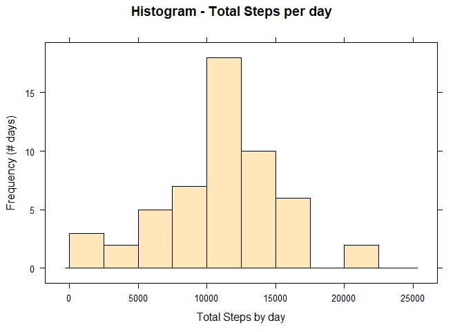
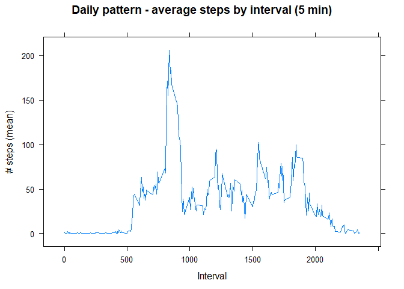
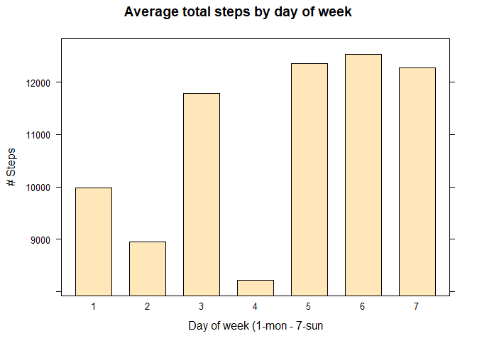
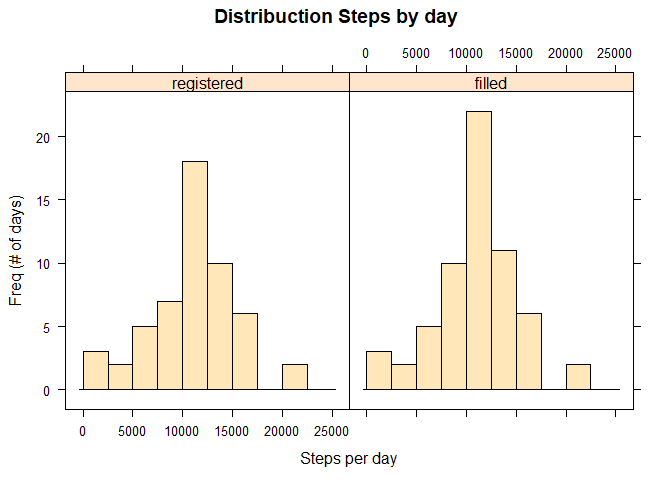
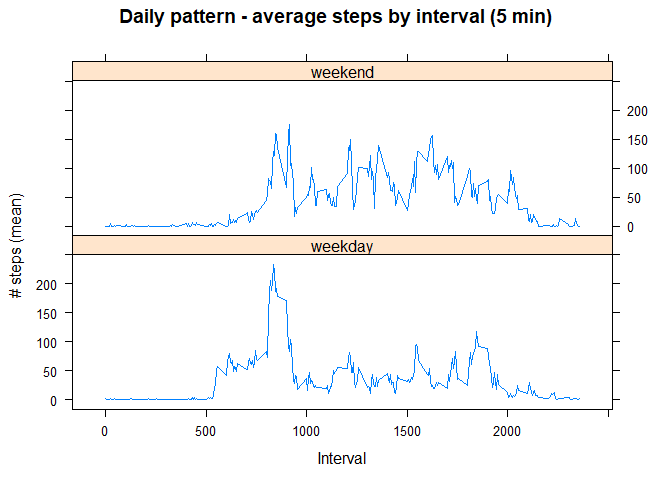
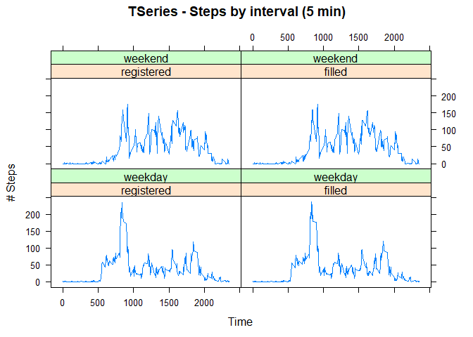
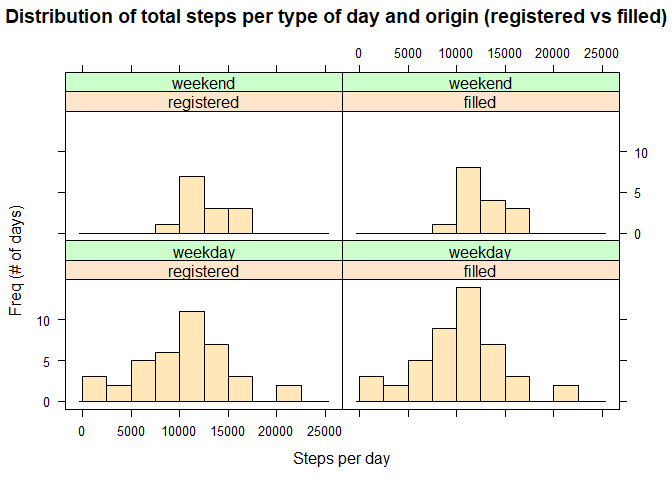

## Intro

This documment includes the work I have made for the Assesstment 1 of the course "Reproducible Research".

More than try to deliver the assigment, I've tried to test things.
I have wrote this as I were explaining the procedure step-by-step.

Sorry for the long explanation. I hope you fid it clear. Regards

## Loading and preprocessing the data

In first place we have to load the libraries we'll use.


```r
library(lubridate)      # lubridate for date management
```

```
## 
## Attaching package: 'lubridate'
```

```
## The following objects are masked from 'package:base':
## 
##     date, intersect, setdiff, union
```

```r
library(lattice)        # lubridate plot system
library(dplyr)          # for data transformation - left_join
```

```
## 
## Attaching package: 'dplyr'
```

```
## The following objects are masked from 'package:stats':
## 
##     filter, lag
```

```
## The following objects are masked from 'package:base':
## 
##     intersect, setdiff, setequal, union
```

```r
library(tidyr)          # for data transformation - pivot_longer
```

### Loading data (Q1)
Next, you unzip the downloaded file `activity.zip`, read the content and store it in a new data frame named `act_data`. This is the base date wich I will work all the assesstment.


```r
unzip("activity.zip")                # unzip downloaded file
act_data <- read.csv("activity.csv") # assign data to act_data data frame 
```

We take a look to `act_data`:


```r
dim(act_data) 
```

```
## [1] 17568     3
```

We have a data frame with 17568 rows and 3 columns (variables).
Let's inspect the data frame:


```r
head(act_data)             # first rows
```

```
##   steps       date interval
## 1    NA 2012-10-01        0
## 2    NA 2012-10-01        5
## 3    NA 2012-10-01       10
## 4    NA 2012-10-01       15
## 5    NA 2012-10-01       20
## 6    NA 2012-10-01       25
```

```r
tail(act_data)             # last rows
```

```
##       steps       date interval
## 17563    NA 2012-11-30     2330
## 17564    NA 2012-11-30     2335
## 17565    NA 2012-11-30     2340
## 17566    NA 2012-11-30     2345
## 17567    NA 2012-11-30     2350
## 17568    NA 2012-11-30     2355
```

and finally we use `str` to see the structure:


```r
str(act_data) 
```

```
## 'data.frame':	17568 obs. of  3 variables:
##  $ steps   : int  NA NA NA NA NA NA NA NA NA NA ...
##  $ date    : chr  "2012-10-01" "2012-10-01" "2012-10-01" "2012-10-01" ...
##  $ interval: int  0 5 10 15 20 25 30 35 40 45 ...
```

You can see 3 variables: 

- `steps`: an integer with number os recorded steps (and with NA records)
- `date`: a string in format "YYYY-MM-DD"
- `interval`: an integer that represents the hour and minutes of the record

Lets count the number of `NAs`:


```r
sum(is.na(act_data$steps))    # NAs in steps variable
```

```
## [1] 2304
```

```r
sum(is.na(act_data$date))    # NAs in data variable
```

```
## [1] 0
```

```r
sum(is.na(act_data$interval))    # NAs in interval variable
```

```
## [1] 0
```

> We find 2304 / 17568 x 100% = 13.11% of `NAs` in the `steps`  variable. There is no `NAs`for date and/or interval variables.

### Prepare de data

To answer the questions, we'll need to make some transformations:

- Convert `date` to a date-time
- Create a new variable `wday`, with the number of weekday from `date`.
- Create a new variable `tday`, wich distinguish weekdays and weekends. This variable is going to be a ordered factor with two levels: "weekday" and "weekend".

Remember that I use the "lubridate" library for date/time management.
Next, the transformations:


```r
# Convert string to date with ymd() function
act_data$date <- ymd(act_data$date)

# new variable wday (day of the week) - I avoid labels due to different language
# and week start criteria in different countries
act_data$wday <- factor(
      wday(act_data$date, week_start = 1),      # 1- start on mondays
      levels = c(1, 2, 3, 4, 5, 6, 7),
      ordered = TRUE
)

# tday - type of day - weekday or weekend
act_data$tday[act_data$wday<=5] <- "weekday"    # 1 - 5 mon to fri
act_data$tday[act_data$wday>=6] <- "weekend"    # 6 - 7 sat and sun

# Convert tday in a factor with levels "weekday" and "weekend"
act_data$tday <- factor(act_data$tday,
                        levels = c("weekday", "weekend"),
                        ordered = TRUE)
```

Finally we have our data frame `act_data` ready for the analysis. Take a look to the structure:


```r
str(act_data) 
```

```
## 'data.frame':	17568 obs. of  5 variables:
##  $ steps   : int  NA NA NA NA NA NA NA NA NA NA ...
##  $ date    : Date, format: "2012-10-01" "2012-10-01" ...
##  $ interval: int  0 5 10 15 20 25 30 35 40 45 ...
##  $ wday    : Ord.factor w/ 7 levels "1"<"2"<"3"<"4"<..: 1 1 1 1 1 1 1 1 1 1 ...
##  $ tday    : Ord.factor w/ 2 levels "weekday"<"weekend": 1 1 1 1 1 1 1 1 1 1 ...
```

## What is mean total number of steps taken per day?

To calculate the mean of steps taken per day, first we need to summary the total steps per day, because our data has steps per interval in a day.

We'll use the function `aggregate` with our data frame `act_data`, grouping by `date` variable. We'll store the result in a new data frame named `steps_day`.


```r
steps_day <-
      act_data %>% 
      filter(!is.na(steps)) %>%  
      group_by(date) %>% 
      summarise(sum = sum(steps))
str(steps_day)
```

```
## tibble [53 x 2] (S3: tbl_df/tbl/data.frame)
##  $ date: Date[1:53], format: "2012-10-02" "2012-10-03" ...
##  $ sum : int [1:53] 126 11352 12116 13294 15420 11015 12811 9900 10304 17382 ...
```

`steps_day` is a data frame with two variables:

- `date`: (date) the date from the original data
- `sum`: (int) the sum of the steps fo all intervals for de date in `date`

### Mean and median (Q3)

Now, we can easilly compute mean and median over the variable `sum` of the data frame `steps_day`:


```r
mean_day <- mean(steps_day$sum,na.rm = TRUE)          # mean of total steps per day
median_day <- median(steps_day$sum,na.rm = TRUE)        # median of total steps per day

mean_day
```

```
## [1] 10766.19
```

```r
median_day
```

```
## [1] 10765
```

### Histogram - total steps per day (Q2)

To understand better the pattern of day activity, we plot the histogram of total steps by day:


```r
histogram(date ~ sum,
      data = steps_day,
      breaks = seq(from = 0, to = 25000, by = 2500),
      type = "count",
      col = "wheat1",
      main = "Histogram - Total Steps per day",
      xlab = "Total Steps by day",
      ylab = "Frequency (# days)"
      
)
```

<!-- -->


## What is the average daily activity pattern?

Now we go deep in understand daily activity pattern.
First, from `act_data`, we compute the mean of steps by interval over all the days (excluding `NAs`). We store the result in a data frame named `steps_interval`.

### Aggregate data by day


```r
steps_interval <- act_data %>% 
      filter(!is.na(steps)) %>% 
      group_by(interval) %>% 
      summarise(mean = mean(steps, na.rm = TRUE))
```

`steps_day` is a df wit two variables:

- `interval`: the number that identifies the time of the record
- `mean`: the mean of steps per inteval over all the dates

### Plot average steps per interval (Q4 & Q5)

Next we plot the time series of the 5min-intervals


```r
# plot time series (type = "l")
xyplot(mean ~ interval, type = "l",
       data = steps_interval,
       main = "Daily pattern - average steps by interval (5 min)",
       xlab = "Interval",
       ylab = "# steps (mean)"
)
```

<!-- -->

Lets see the summary of this pattern:

```r
summary(steps_interval$mean)
```

```
##    Min. 1st Qu.  Median    Mean 3rd Qu.    Max. 
##   0.000   2.486  34.113  37.383  52.835 206.170
```

We can see a the average peak before 1000. We want to locate the interval where de average steps are the maximum: 


```r
max_interval <-
      steps_interval$interval[which.max(steps_interval$mean)]     # returns the interval where the mean steps are the maximum
max_interval
```

```
## [1] 835
```

> The maximum of average steps in an interval is 206.1698113 at 835.

## Imputing missing values (Q6)

As we find in the beggining, we find 3.204 NAs in steps variable.


```r
sum(is.na(act_data$steps))    # NAs in steps variable
```

```
## [1] 2304
```

We have several options to define a strategy to fill `NAs`. 
In general, is commonly acepted that the activity pattern depends on the day of the week.

>The strategy I propose is to fill each `NA` with the average number of steps for the same interval and the same day of the week (i.e. the `NA` of an interval 1430 in monday _wday = 1_ is filled with the average of interval 1430 of all the mondays.

Previous to make this procedure, we are going to test that this is a reasonable option with the data we have.

### Daily pattern by day of the week
First, we can check if there is any pattern over the day of the week, so we compute de average total steps per day of the week:


```r
# 1st aggregate data by date an day of the week to sum the total steps per day
steps_day <- act_data %>%
      filter(!is.na(steps)) %>% 
      group_by(date,wday) %>% 
      summarise(sum = sum(steps, na.rm = TRUE))
```

```
## `summarise()` has grouped output by 'date'. You can override using the `.groups` argument.
```

```r
# 2nd aggregate data by day of the week to compute the average total steps per day of the week
aggr_steps_day <- steps_day %>% 
      group_by(wday) %>% 
      summarise(mean = mean(sum))
aggr_steps_day
```

```
## # A tibble: 7 x 2
##   wday    mean
## * <ord>  <dbl>
## 1 1      9975.
## 2 2      8950.
## 3 3     11791.
## 4 4      8213.
## 5 5     12360.
## 6 6     12535.
## 7 7     12278.
```

We can see there is significant differences between every day of the week. We make a Plot to see it better:


```r
barchart(mean ~ wday, type = "l",
       data = aggr_steps_day,
       col = "wheat1",
       main = "Average total steps by day of week",
       xlab = "Day of week (1-mon - 7-sun",
       ylab = "# Steps"
)
```

<!-- -->

### Pattern of NAs ofer intervals and day of week

Next, we look for the distribution of NAs per interval and day of the week.


```r
count_samples <- with(act_data,table(interval,wday))  # wday -> 1 monday - 7 sunday
head(count_samples)           # first lines
```

```
##         wday
## interval 1 2 3 4 5 6 7
##       0  9 9 9 9 9 8 8
##       5  9 9 9 9 9 8 8
##       10 9 9 9 9 9 8 8
##       15 9 9 9 9 9 8 8
##       20 9 9 9 9 9 8 8
##       25 9 9 9 9 9 8 8
```

```r
tail(count_samples)           # last lines
```

```
##         wday
## interval 1 2 3 4 5 6 7
##     2330 9 9 9 9 9 8 8
##     2335 9 9 9 9 9 8 8
##     2340 9 9 9 9 9 8 8
##     2345 9 9 9 9 9 8 8
##     2350 9 9 9 9 9 8 8
##     2355 9 9 9 9 9 8 8
```

As you can see, there are 9 records per interval from Monday to Friday (1 to 5). And 8 records per interval for saturday an Sunday (6 and 7)

Following a similar procedure, we obtain the distribution of `NAs` per interval and day of the week:


```r
count_nas <- with(act_data[is.na(act_data$steps),],table(interval,wday,exclude = NA))  # wday -> 1 monday - 7 sunday
head(count_nas)           # first lines
```

```
##         wday
## interval 1 2 3 4 5 6 7
##       0  2 0 1 1 2 1 1
##       5  2 0 1 1 2 1 1
##       10 2 0 1 1 2 1 1
##       15 2 0 1 1 2 1 1
##       20 2 0 1 1 2 1 1
##       25 2 0 1 1 2 1 1
```

```r
tail(count_nas)           # last lines
```

```
##         wday
## interval 1 2 3 4 5 6 7
##     2330 2 0 1 1 2 1 1
##     2335 2 0 1 1 2 1 1
##     2340 2 0 1 1 2 1 1
##     2345 2 0 1 1 2 1 1
##     2350 2 0 1 1 2 1 1
##     2355 2 0 1 1 2 1 1
```

You can see that whe have, 2 `NAs` records per interval on Mondays (wday == 1) and Fridays (wday == 5). There is no NAs on Tuesdays (wday = 2), and there is 1 `NA` record per interval for the rest of the days of the week.

Finally, we comopute the ratio of NAs vs total of records.


```r
ratio_nas <- count_nas / count_samples  # wday -> 1 monday - 7 sunday
head(ratio_nas)           # first lines
```

```
##         wday
## interval         1         2         3         4         5         6         7
##       0  0.2222222 0.0000000 0.1111111 0.1111111 0.2222222 0.1250000 0.1250000
##       5  0.2222222 0.0000000 0.1111111 0.1111111 0.2222222 0.1250000 0.1250000
##       10 0.2222222 0.0000000 0.1111111 0.1111111 0.2222222 0.1250000 0.1250000
##       15 0.2222222 0.0000000 0.1111111 0.1111111 0.2222222 0.1250000 0.1250000
##       20 0.2222222 0.0000000 0.1111111 0.1111111 0.2222222 0.1250000 0.1250000
##       25 0.2222222 0.0000000 0.1111111 0.1111111 0.2222222 0.1250000 0.1250000
```

```r
tail(ratio_nas)           # last lines
```

```
##         wday
## interval         1         2         3         4         5         6         7
##     2330 0.2222222 0.0000000 0.1111111 0.1111111 0.2222222 0.1250000 0.1250000
##     2335 0.2222222 0.0000000 0.1111111 0.1111111 0.2222222 0.1250000 0.1250000
##     2340 0.2222222 0.0000000 0.1111111 0.1111111 0.2222222 0.1250000 0.1250000
##     2345 0.2222222 0.0000000 0.1111111 0.1111111 0.2222222 0.1250000 0.1250000
##     2350 0.2222222 0.0000000 0.1111111 0.1111111 0.2222222 0.1250000 0.1250000
##     2355 0.2222222 0.0000000 0.1111111 0.1111111 0.2222222 0.1250000 0.1250000
```

With these results, we can conclude the proposal we made at the beggining of this subject, is quite reasonable.


### Defining a strategy to fill NAs

Related to the analisys we have made previously, our strategy is to fill `NAs` of an specific interval for a specific date with the average number of steps for the same intefval and the same day of the week of de date we want to fill.

The steps to do it are:

1. Copy the data to a new data set, named `act_data_fill`, where we fill the NAs 
2. Summarise the data a by: 1. interval, 2. day of the week, and compute the mean of the steps.
3. Build a vector with the values to filled (for this, we'll use the left_join )

#### Build data frame with filled data

Create a copy of the `act_data`, called `act_data_fill`:


```r
act_data_fill <- act_data
```

Obtain the mean number of steps per interval and day of the week, and store it in a variable `avg_steps_inter_wday`. 

#### Calculate average steps per interval and day of week

Compute the aggregate the mean of `act_data` by `wday` and `interval `variables. The result is assigned to a data frame named `avg_steps_inter_wday`.


```r
avg_steps_inter_wday <- act_data %>%
      filter(!is.na(steps)) %>% 
      group_by(wday,interval) %>% 
      summarise(mean = round(mean(steps, na.rm = TRUE),0))
```

```
## `summarise()` has grouped output by 'wday'. You can override using the `.groups` argument.
```

```r
head(avg_steps_inter_wday)          # Show data frame
```

```
## # A tibble: 6 x 3
## # Groups:   wday [1]
##   wday  interval  mean
##   <ord>    <int> <dbl>
## 1 1            0     1
## 2 1            5     0
## 3 1           10     0
## 4 1           15     0
## 5 1           20     0
## 6 1           25     5
```

> Note: I have rounded the mean to 0 decimal digits, because we are going to fill number of steps, and steps are integer.

Now we build a dataframe named as `fill_df`, with all the values to be filled. We'll use the `left_join` function from `dplyr` to paste the appropiate value in each record by `wday` and `interval`.


```r
fill_df <- act_data %>% 
      filter(is.na(steps)) %>%            # fill vector only has the rows with NAs
      select(date, interval,wday) %>%     # we select, date, interval and wday - day of the week
      # we use left_join to preserve all the rows form act_data and join by interval and wday
      left_join(avg_steps_inter_wday, by = c("interval","wday"))

head(fill_df, 10)       # 10 first rows
```

```
##          date interval wday mean
## 1  2012-10-01        0    1    1
## 2  2012-10-01        5    1    0
## 3  2012-10-01       10    1    0
## 4  2012-10-01       15    1    0
## 5  2012-10-01       20    1    0
## 6  2012-10-01       25    1    5
## 7  2012-10-01       30    1    0
## 8  2012-10-01       35    1    0
## 9  2012-10-01       40    1    0
## 10 2012-10-01       45    1    0
```

Finally we fill all the `NAs` in the `filled` from `act_data_fill` with the values from `fill_df$steps`.


```r
# duplicate steps variable in a new filled variable.
act_data_fill$filled <- act_data_fill$steps

# assign average steps stored in fill_df to the subset of NA of filled variable from act_data_fill
act_data_fill$filled[is.na(act_data_fill$steps)] <- fill_df$mean

act_data_fill <- act_data_fill %>% rename(registered = steps)

str(act_data_fill)
```

```
## 'data.frame':	17568 obs. of  6 variables:
##  $ registered: int  NA NA NA NA NA NA NA NA NA NA ...
##  $ date      : Date, format: "2012-10-01" "2012-10-01" ...
##  $ interval  : int  0 5 10 15 20 25 30 35 40 45 ...
##  $ wday      : Ord.factor w/ 7 levels "1"<"2"<"3"<"4"<..: 1 1 1 1 1 1 1 1 1 1 ...
##  $ tday      : Ord.factor w/ 2 levels "weekday"<"weekend": 1 1 1 1 1 1 1 1 1 1 ...
##  $ filled    : num  1 0 0 0 0 5 0 0 0 0 ...
```

```r
# check the number of NAs on filled data.
num_nas <-sum(act_data_fill$filled[is.na(act_data_fill$filled)])
num_nas
```

```
## [1] 0
```

As you can see, there is no `NAs` in filled data.

#### Analyzing filled data (Q7)

Following the same process as before, we aggregate `act_data_fill` by `date` variable.


```r
steps_day_fill <- act_data_fill %>% 
      group_by(date) %>% 
      summarise(sum = sum(filled, na.rm = TRUE))

# Mean of filled variable
mean_day_fill <- mean(steps_day_fill$sum, na.rm = TRUE)
mean_day_fill
```

```
## [1] 10821.1
```

```r
# Mean of original variable
mean_day
```

```
## [1] 10766.19
```

```r
#How much bigger is the mean with filled data?
mean_day_fill / mean_day
```

```
## [1] 1.0051
```

> As you can see, the mean of filled data is 15.7% greater than the original.

We do the same with the median.


```r
# Mean of filled variable
median_day_fill <- median(steps_day_fill$sum, na.rm = TRUE)
median_day_fill
```

```
## [1] 11015
```

```r
# Mean of original variable
median_day
```

```
## [1] 10765
```

```r
#How much bigger is the mean with filled data?
median_day_fill / median_day
```

```
## [1] 1.023223
```

> The median for filled data is almost 6% greater than the original data. 

To better understand of the reason os these changes, I make a histogram plot comparing registered (original) data vs filled data:


```r
# Create a df with both registered and filled data pivoted with a new variable 
# origin, with two levels: "registered" or "filled".
act_data_union <-
      act_data_fill %>% pivot_longer(c("registered", "filled"),
      names_to = "origin",
      values_to = "steps")

# Convert Origin in a ordered factor
act_data_union$origin <-
      factor(
            act_data_union$origin,
            levels = c("registered", "filled"),
            ordered = TRUE
      )

# Aggregate the total steps per date, type of day and oigin
steps_day_union <- act_data_union %>% 
      filter(!is.na(origin)) %>% 
      group_by(date,tday,origin) %>% 
      summarise(sum = sum(steps))
```

```
## `summarise()` has grouped output by 'date', 'tday'. You can override using the `.groups` argument.
```

```r
# histogram with registered data (the same as above) and the histogram with 
# the filled data
histogram( ~ sum | origin, 
        data = steps_day_union,
        breaks = seq(from = 0, to = 25000, by = 2500),
        type = "count",
        col = "wheat1",
        main = "Distribuction Steps by day",
        xlab = "Steps per day",
        ylab = "Freq (# of days)"
)
```

<!-- -->

You can see clearly the most difference between filled data and registered data:

* Significant decrease of number of days with less than 2500 steps (almost 12 to 3)
* Significant increase of number of days between 10000 an 12500 steps (almost 18 to more than 20)
* Increase o number of days between 7500 and 10000 steps (from 7 to 10)


## Are there differences in activity patterns between weekdays and weekends? (Q8)

To evaluate differences in daily patterns between weekdays and weekends we start with a summary for each one.

### Daily interval pattern

Firs, we aggregate the mean steps by interval and type of day. We repeat the process at the beggining with `steps_interval`, but including the `tday` variable:


```r
# Aggregate steps by interval and type of day - original data
steps_interval <- aggregate(          
      act_data$steps,
      by = list(act_data$interval, act_data$tday),
      FUN = function(x)
            mean(x, na.rm = TRUE)
)
names(steps_interval) <- c("interval","tday","mean")      # assign names to the result variables
```

You now summarizes each data by separate (weekdays and weekends):


```r
summary(steps_interval$mean[steps_interval$tday == "weekday"])
```

```
##    Min. 1st Qu.  Median    Mean 3rd Qu.    Max. 
##   0.000   2.218  23.974  35.338  51.872 234.103
```

```r
summary(steps_interval$mean[steps_interval$tday == "weekend"])
```

```
##    Min. 1st Qu.  Median    Mean 3rd Qu.    Max. 
##   0.000   1.107  32.036  43.078  75.571 175.000
```

> You find mean and median in weekend is greater than weekday. Also you find than max average steps interval in weekday is higher that weekend ones.

Lets look in a time plot comparing weekend and weekday:


```r
xyplot(mean ~ interval | tday , type = "l",
       data = steps_interval,
       layout = c(1,2),
       main = "Daily pattern - average steps by interval (5 min)",
       xlab = "Interval",
       ylab = "# steps (mean)"
)
```

<!-- -->

This view complements the summaries we compute just before. You can see than activity is high in the weekdays before 10:00, and remains bellow 100 steps per interval during the rest of the day.

In the other side, weekends a more regular along the day.

Lets Compare daily interval average per type of day (weekday vs weekend) and from registered data vs filled data.


```r
# Aggregate the total steps per interval, type of day and oigin (registered and filled data)

steps_interval_union <- aggregate(
      act_data_union$steps,
      by = list(act_data_union$interval, act_data_union$tday, act_data_union$origin),
      FUN = function(x)
            mean(x, na.rm = TRUE)
)
names(steps_interval_union) <- c("interval", "tday","origin","mean")

# Plot the time serie of intervals comparing type of the day and origin of data
xyplot(mean ~ interval | origin + tday , type = "l",
       data = steps_interval_union,
       layout = c(2,2),
        main = "TSeries - Steps by interval (5 min)",
        xlab = "Time",
        ylab = "# Steps"
        )
```

<!-- -->

> There is no clear difference between daily average steps per interval when we compare registered (original) data vs filled data. This makes sense, because we used the meaan steps per interval and day of the week to fill the NAs in each interval and day of the week.    

### Daily pattern

Lets compare differences between weekday and weekend, looking for the total number of steps per day

First, the mean of total steps by type of day and origin (registered vs filled)


```r
# Aggregate the total steps per date, type of day and oigin
mean_day_union <- aggregate(
      steps_day_union$sum,
      by = list(steps_day_union$tday, steps_day_union$origin),
      FUN = function(x)
            mean(x, na.rm = TRUE)
)
names(mean_day_union) <- c("tday","origin","mean")
mean_day_union
```

```
##      tday     origin     mean
## 1 weekday registered 10177.33
## 2 weekend registered 12406.57
## 3 weekday     filled 10257.56
## 4 weekend     filled 12406.06
```

> The mean of total steps per day in weekend is higher than weekdays. The same conclusion is valid for registered (original) and filled data.

Next,repeat the same with the median:


```r
# Aggregate the total steps per date, type of day and oigin
median_day_union <- aggregate(
      steps_day_union$sum,
      by = list(steps_day_union$tday, steps_day_union$origin),
      FUN = function(x)
            median(x, na.rm = TRUE)
)
names(median_day_union) <- c("tday","origin","median")
median_day_union
```

```
##      tday     origin  median
## 1 weekday registered 10304.0
## 2 weekend registered 12130.0
## 3 weekday     filled 10304.0
## 4 weekend     filled 12347.5
```

An finally, we plot histograms to compare patter of total steps per day.


```r
# plot the histogram using Lattice Plot systems, where whe plot side-by-side
# histogram with registered data (the same as above) and the histogram with 
# the filled data
histogram( ~ sum | origin + tday, 
        data = steps_day_union,
        breaks = seq(from = 0, to = 25000, by = 2500),
        layout = c(2,2),
        type = "count",
        col = "wheat1",
        main = "Distribution of total steps per type of day and origin (registered vs filled)",
        xlab = "Steps per day",
        ylab = "Freq (# of days)"
)
```

<!-- -->

> We can conclude that weekdays and weekends have the peek off activity on 10000 to 12500 steps per day. What makes difference is tha activity in weekends has residual activity bellow 10000 steps per day.
